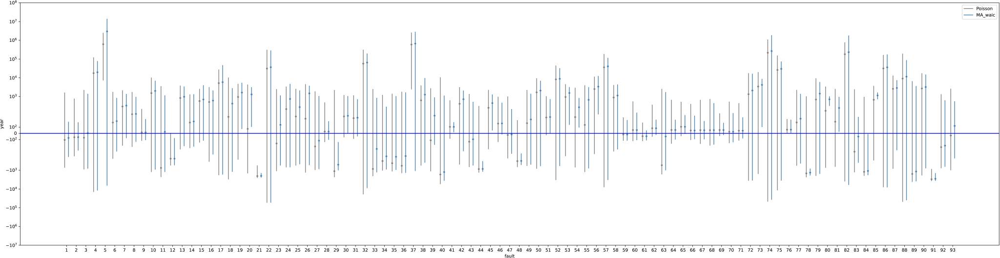
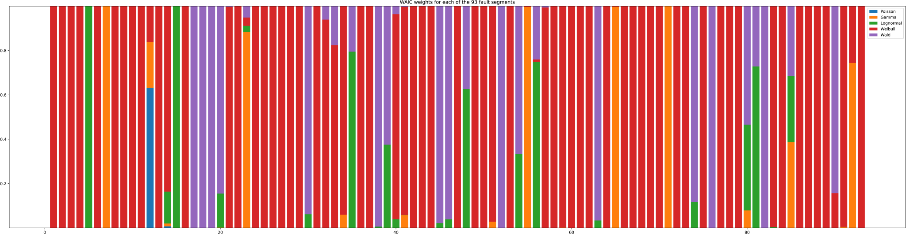

# 贝叶斯地震预测

本报告旨在复现并阐述 [Earthquake forecasting from paleoseismic records](https://doi.org/10.1038/s41467-024-46258-z) 一文中所提出的贝叶斯地震预测方法。

## 方法框架

该方法框架针对总共 $i = 1, 2, \dots, 93$ 个断层。对于每个断层，通过蒙特卡洛（MC）方法进行 $k = 1, 2, \dots, 100$ 次采样，以处理古地震记录中的年代不确定性，从而生成一系列可能的地震发生时间序列：

$$t_{k0} < t_{k1} < \cdots < t_{kN_i} \leq T = 2022.$$

对于第 $i$ 个断层上的第 $k$ 次采样序列，两次连续地震之间的时间间隔被定义为：

$$x_{k1} = t_{k1} - t_{k0}, \dots, x_{kN_i} = t_{kN_i} - t_{k(N_i - 1)}.$$

该研究采用五种不同的统计模型来拟合地震重现期 $x_{kj}$ 的分布。这些模型均假设重现期 $\{x_{kj}\}_{j=1}^{N_i}$ 为独立同分布序列，其概率密度函数（PDF）记为 $f(x;\theta_k)$。所使用的五种模型及其PDF如下：

1. 泊松 (Poisson) 过程 (指数分布)
    $$f(x;\lambda,Z_k) = Z_k\lambda \exp\left(-Z_k\lambda x\right)$$
2. 伽马 (Gamma) 分布
    $$f(x;\alpha,\lambda,Z_k,Y_k) =\frac1{\Gamma(Z_k\alpha)}(Y_k\lambda)^{Z_k\alpha}x^{Z_k\alpha-1}\exp(-Y_k\lambda x)$$
3. 威布尔 (Weibull) 分布
    $$f(x;\alpha,\lambda,Z_k,Y_k) =Z_k\alpha(Y_k\lambda)^{Z_k\alpha}x^{Z_k\alpha-1}\exp(-(Y_k\lambda x)^{Z_k\alpha})$$
4. 逆高斯 (Inverse Gaussian) 分布
    $$f(x;\mu,\beta,Z_k,Y_k) =\sqrt{\frac{Z_k\mu}{2\pi(Y_k\beta)^2x^3}}\exp\left(-\frac{(x-Z_k\mu)^2}{2Z_k\mu(Y_k\beta)^2x}\right)$$
5. 对数正态 (Lognormal) 分布
    $$f(x;\mu,\sigma,Z_k,Y_k) = \frac{1}{x\sqrt{2\pi}Y_k\sigma}\exp\left(-\frac{1}{2(Y_k\sigma)^{2}}\left(\log x-Z_k\mu\right)^{2}\right)$$

模型参数 $\theta_k = (\mu,\sigma,\alpha,\beta,\lambda,Z_k,Y_k)$ 的估计采用贝叶斯推断。其似然函数 $L$ 的构造考虑了最后一次地震到观测截止时间 $T$ 的开放区间（右删失数据），具体形式如下：

$$L(\theta_{k};t_{k1},\ldots,t_{kN_{i}},T)=(1-F(T-t_{kN_{i}};\theta_{k}))\prod_{j=1}^{N_{i}}f(t_{kj}-t_{k(j-1)};\theta_{k}),$$

其中 $F$ 是对应模型 $f$ 的累积分布函数（CDF）。

为完成贝叶斯模型设定，各参数的先验分布假定如下：

$$
\begin{gather*}
Y_k\sim \textrm{Gamma}(1/\sigma_Y^2,1/\sigma_Y^2),\quad Z_k\sim \textrm{Gamma}(1/\sigma_Z^2,1/\sigma_Z^2),\\
\alpha\sim N(0,100^{2})T(0,),\quad \lambda\sim N(0,100^{2})T(0,), \\
\mu\sim N(0,100^{2})T(0,),\quad \beta\sim dt(0,0.04,3)T(0,), \\
\sigma\sim dt(0,0.04,3)T(0,),\quad \sigma_{Y}\sim dt(0,0.04,3)T(0,), \quad
\sigma_{Z}\sim dt(0,0.04,3)T(0,).
\end{gather*}
$$

根据贝叶斯定理，参数的后验分布正比于似然函数与先验分布的乘积：

$$p\left(\theta_k \mid t_{k1},\ldots,t_{kN_{i}},T\right) \propto L(\theta_{k};t_{k1},\ldots,t_{kN_{i}},T)p(\theta_k),$$

参数的点估计采用后验均值，该估计量是均方误差（MSE）风险下的贝叶斯估计。对于参数矢量 $\theta_k$ 的第 $j$ 个分量 $\theta_k^j$，其后验均值计算如下：

$$
E(\theta_k^j \mid t_{k1},\dots,t_{kN_{i}},T) = \int \theta_k^j p(\theta_k \mid t_{k1},\dots,t_{kN_{i}},T) \, d\theta_k.
$$

由于上述后验分布的积分难以求得解析解，本研究利用马尔可夫链蒙特卡洛（MCMC）方法进行数值近似计算。

为综合不同模型的预测能力，研究采用了基于WAIC信息准则的贝叶斯模型平均（BMA）方法。通过对五个模型进行加权，得到最终的模型平均后验分布，并以此为基础进行预测。

## 结果

### 回溯性预测（留一法交叉验证）

下图展示了模型的回溯性预测能力，通过留一法交叉验证（LOOCV）进行评估。

### 贝叶斯模型平均权重

下图展示了通过WAIC计算得出的各模型在贝叶斯模型平均中所占的权重。

